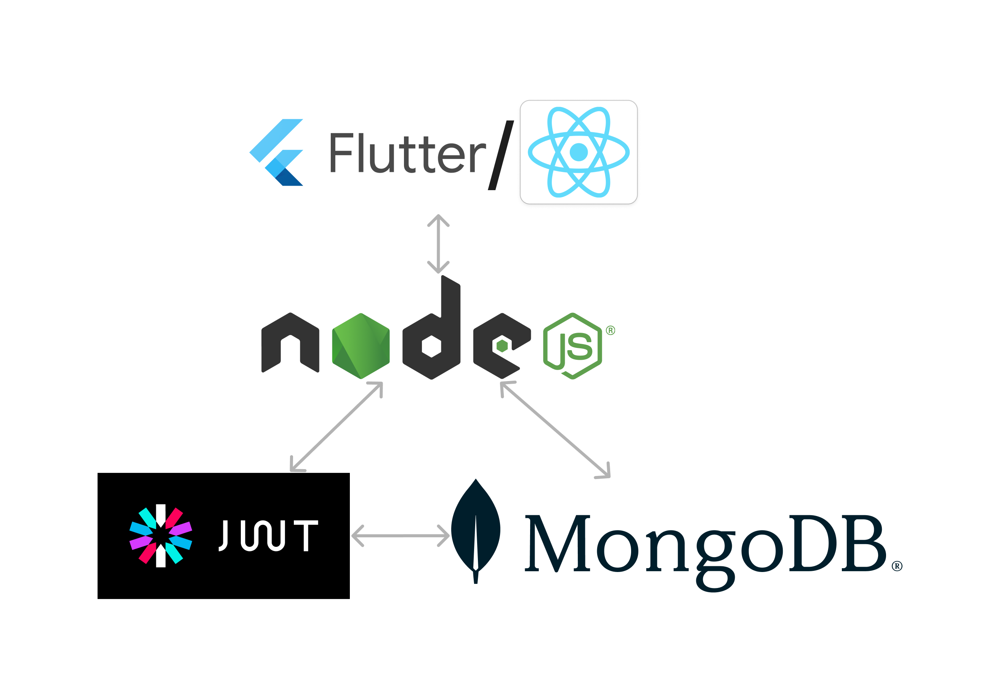

# Cafeflow

Cafeflow is a software system which allows customers to buy and return plastic bottles and order food online from a cafe in college. This was created for the cafes of Indian Institute of Information Technology Kottayam (IIITK). IIITK implemented a plastic token of ```INR 10``` for every purchase of a plastic item from the shops and cafe in campus. The amount will be refunded once the token and the empty plastic item is returned to the shop/cafe. This plastic token is easy to loose and made of plastic defeating the purpose of reducing plastic waste.

Cafeflow was created to tackle this challenge. The users no longer have to pay extra for plastic items in college campus. A unique token number will be generated for each plastic item bought either offline or online. The token will be linked to the unique userID of the students. The data of plastic items can be shared with the authorities so students can be held accountable for throwing waste around the campus.
## Tech Used


**Server:** Node, Express, JWT, MongoDB


## Authors

- [@ashblend17](https://www.github.com/ashblend17)
- [@sasya88](https://www.github.com/sasya88)


## Features

- User authentication and authorization.
- Food Ordering.
- Plastic item buying.
- Returning plastic item.
- Checking food order and plastic history.
- Check food status.

#### User Window
- Upon logging in, users are presented with a user-friendly window offering several options:
    - Menu browsing and Ordering Food: 
        - By selecting this option, users are directed to a menu page where they can browse through a variety of food items. They can increment or decrement the quantity of selected items using intuitive controls (+/-).
        - The manager accepts or rejects the order based on availability.
        - Upon confirming their food order, users are redirected to a page displaying the total amount to be paid for accepted items. Here, they are presented with two buttons - "Confirm" and "Cancel".
        - Clicking on "Confirm" redirects the user to the payment page.

    - Plastic Item Count: 
        - Users can conveniently view the count of plastic items associated with their account.

    - Returning Plastic Items:
        - By selecting this option users are directed to plastics return page. Here, users can select plastic items they want to return and can click on 'confirm' button to place return request.

#### Manager Window
- Orders placed by users are automatically routed to the manager for approval. The manager is presented with options to either "Accept" or "Reject" the order.
- Upon acceptance, the order is seamlessly relayed to the kitchen staff for further processing.
- The status of the order is updated for the user based on the Manager's input.
- The manager can verify if the plastic item has been returned and update the status of the item for the user.

#### Chef Window
- Upon receiving an approved order, the kitchen staff initiates the food preparation process.
- Once the food is ready,the chef can simply click on the "Notify" button within the system to inform the user that their order is ready for pickup.
- After delivery, they can update the status of order to delivered.

## Run Locally

Clone the project

```bash
    git clone https://link-to-project
```

Go to the project directory

```bash
    cd cafeflow-backend-OS
```

Install dependencies

```bash
    npm install
```

Start the server

```bash
    npm run start
```


## Environment Variables

To run this project, you will need to add the following environment variables to your .env file

```    
    jwt_key=<insert key here>
    IP='<insert IP here>'
    port=<insert port number here>
    MONGO_ATLAS_PW=<insert password here>
    DB_CONNECT_STRING='<insert mongodb connection string here>'
```

## Map




## Future scope

- Introducing new features and functionalities based on user feedback.
- Scalability and adaptability of the software.
- Adding better statistics and data analytics for the café manager.
- Improving UI/UX.
- Improving software workflow by analyzing user data and usage patterns.
- Integrating payment interface.
- Improving the working of token system keeping in mind available technologies (RFID, QR, etc.)
